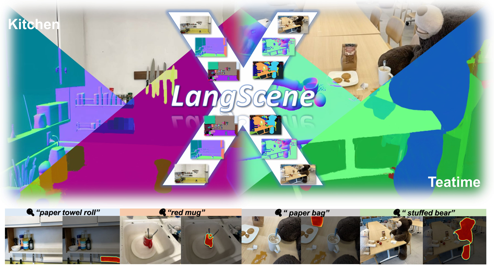
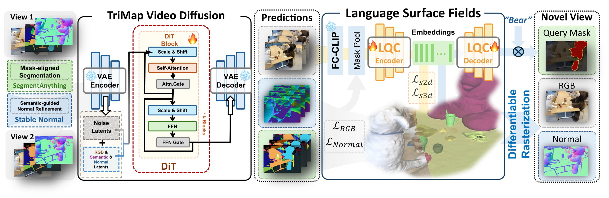

<div align="center">

# ✨LangScene-X: Reconstruct Generalizable 3D Language-Embedded Scenes with TriMap Video Diffusion✨

<p align="center">
<a href="https://liuff19.github.io/">Fangfu Liu</a><sup>1</sup>,
<a href="https://lifuguan.github.io/">Hao Li</a><sup>2</sup>,
<a href="https://github.com/chijw">Jiawei Chi</a><sup>1</sup>,
<a href="https://hanyang-21.github.io/">Hanyang Wang</a><sup>1,3</sup>,
<a href="https://github.com/chijw/LangScene-X">Minghui Yang</a><sup>3</sup>,
<a href="https://github.com/chijw/LangScene-X">Fudong Wang</a><sup>3</sup>,   
<a href="https://duanyueqi.github.io/">Yueqi Duan</a><sup>1</sup>
<br>
    <sup>1</sup>Tsinghua University, <sup>2</sup>NTU, <sup>3</sup>Ant Group     
</p>
<h3 align="center">ICCV 2025 🔥</h3>
<a href="https://github.com/chijw/LangScene-X"></a> &nbsp;&nbsp;&nbsp;&nbsp;
<a href="https://github.com/chijw/LangScene-X"></a> &nbsp;&nbsp;&nbsp;&nbsp;
<a></a> &nbsp;&nbsp;&nbsp;&nbsp;
<a href="https://huggingface.co/chijw/LangScene-X"></a> &nbsp;&nbsp;&nbsp;&nbsp;



</div>

**LangScene-X:** We propose LangScene-X, An unified model that generates RGB, segmentation map, and normal map and the following reconstructed 3D field from sparse views input.

## 📢 News
- 🔥 [04/07/2025] We release "LangScene-X: Reconstruct Generalizable 3D Language-Embedded Scenes with TriMap Video Diffusion". Check our [project page](https://github.com/chijw/LangScene-X) and [arXiv paper](https://github.com/chijw/LangScene-X).

## 🌟 Pipeline



Pipeline of LangScene-X. Our model is composed of a TriMap Video Diffusion model which generates RGB, segmentation map, and normal map videos, an Auto Encoder that compress the language feature, and a field constructor that reconstruct 3DGS from the generates videos. 

## ⚙️ Setup

### 1. Clone Repository
```bash
git clone https://github.com/chijw/LangScene-X.git
cd LangScene-X
```
### 2. Environment Setup

1. **Create conda environment**

```bash
conda create -n langscenex python=3.10 -y
conda activate langscenex
```
2. **Install dependencies**
```bash
conda install pytorch torchvision -c pytorch -y
pip install -e submodules/simple-knn
pip install -e submodules/segment-anything-langsplat
pip install -e auto-seg/submodules/segment-anything-1
pip install -e auto-seg/submodules/segment-anything-2
pip install -r requirements.txt
```

### 3. Model Checkpoints
The checkpoints of SAM, SAM2 and fine-tuned CogVideoX can be downloaded from our [huggingface repository](https://huggingface.co/chijw/LangScene-X).

## 💻Running

### Quick Start
You can start quickly by running the following scripts:
```bash
chmod +x quick_start.sh
./quick_start.sh <first_rgb_image_path> <last_rgb_image_path>
```
### Render
Run the following command to render from the reconstructed 3DGS field:
```bash 
python entry_point.py \
    pipeline.rgb_video_path="does/not/matter" \
    pipeline.normal_video_path="does/not/matter" \
    pipeline.seg_video_path="does/not/matter" \
    pipeline.data_path="does/not/matter" \
    gaussian.dataset.source_path="does/not/matter" \
    gaussian.dataset.model_path="output/path" \
    pipeline.selection=False \
    gaussian.opt.max_geo_iter=1500 \
    gaussian.opt.normal_optim=True \
    gaussian.opt.optim_pose=True \
    pipeline.skip_video_process=True \
    pipeline.skip_lang_feature_extraction=True \
    pipeline.mode="render"
```
You can also configurate by editting `configs/field_construction.yaml`.

## 🔗Acknowledgement

We are thankful for the following great works when implementing LangScene-X:

- [CogVideoX](https://github.com/THUDM/CogVideo), [CogvideX-Interpolation](https://github.com/feizc/CogvideX-Interpolation), [LangSplat](https://github.com/minghanqin/LangSplat), [LangSurf](https://github.com/lifuguan/LangSurf), [VGGT](https://github.com/facebookresearch/vggt), [3DGS](https://github.com/graphdeco-inria/gaussian-splatting), [SAM2](https://github.com/facebookresearch/sam2)

## 📚Citation

```bibtex
@article{
}
```
